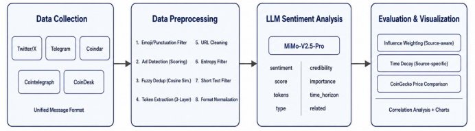

# LLM4Crypto

> 基于大语言模型的加密货币新闻与社交媒体信息采集实验


## 摘要

LLM4Crypto 是一个端到端的加密货币市场情绪分析系统。系统整合 Twitter/X、Telegram、Coindar、Cointelegraph 及 CoinDesk 共五个异构数据源，经过八步清洗流程，使用小米 MiMo-V2.5-Pro大语言模型输出十个结构化分析字段，并引入数据源感知的影响力加权与差异化时间衰减机制计算加权情绪得分。实验结果表明，等权情绪得分与 24 小时价格变化的皮尔逊相关系数为 0.366，呈中等程度正相关，验证了该方法的有效性。

---

## 系统架构



系统流水线分为四个阶段：

**数据采集** → **数据预处理** → **LLM 情绪分析** → **评估与可视化**

---

## 项目结构

```
llm4crypto/
├── collectors/                  # 数据采集模块
│   ├── twitter_scraper.py       # Twitter/X（twscrape，GraphQL 逆向）
│   ├── telegram_listener.py     # Telegram（Telethon，客户端 API）
│   ├── coindar.py               # Coindar（REST API，事件日历）
│   ├── cointelegraph_rss.py     # Cointelegraph（RSS 订阅）
│   └── coindesk_rss.py          # CoinDesk（RSS 订阅）
├── processing/                  # 数据清洗模块
│   └── cleaner.py               # 八步清洗流程
├── analysis/                    # 分析模块
│   ├── sentiment.py             # LLM 情绪分析
│   └── price_compare.py         # 价格对比 + 可视化
├── data/                        # 数据目录（运行时生成）
├── visualization/               # 可视化图表输出
├── config.py                    # 全局配置 + 统一 Message 数据模型
├── main.py                      # 一键运行入口
├── requirements.txt             # 依赖列表
└── README.md
```

## 数据来源

| 数据源 | 采集方式 | 采集内容 |
|--------|---------|---------|
| Twitter/X | twscrape（GraphQL 逆向） | KOL 推文 + 关键词搜索（$BTC、$ETH 等） |
| Telegram | Telethon（客户端 API） | 频道消息（binance_announcements 等） |
| Coindar | REST API | 加密货币事件日历（上币、空投、分叉等） |
| Cointelegraph | RSS（feedparser） | 专业加密货币新闻 |
| CoinDesk | RSS（feedparser） | 权威加密货币新闻 |

## 数据清洗流程（八步）

| 步骤 | 功能 | 实现方式                                              |
|------|------|---------------------------------------------------|
| 1 | 去除纯表情消息 | Unicode 正则匹配，去除后无实质内容则过滤                          |
| 2 | 去除纯标点消息 | 去除标点和空格后无内容则过滤                                    |
| 3 | 去除广告 | 综合评分：关键词分级 + 链接密度 + 表情密度                          |
| 4 | 去重 | 包含（MD5）精准去重和余弦相似度（阈值 0.85）模糊去重，覆盖同平台和跨平台          |
| 5 | 代币提取 | 三层匹配：$BTC cashtag + CoinGecko 13000+ 代币交叉验证 + 全名映射 |
| 6 | URL 清洗 | 链接替换为 [link] 占位符                                  |
| 7 | 信息熵过滤 | 香农信息熵 < 2.0 判定为低质量内容（跳过 Coindar）                  |
| 8 | 去除短文本 | 去除 emoji 后不足 10 字符的消息（跳过 Coindar）                 |

## LLM 情绪分析

使用 MiMo-V2.5-Pro 模型，通过兼容 OpenAI 接口的 API 调用，批量处理（每批 5 条）。输出十个结构化字段：

| 字段 | 说明 |
|------|------|
| is_crypto_related | 是否与加密货币市场相关 |
| tokens | 涉及的代币（如 ["BTC", "ETH"]） |
| sentiment | 情绪倾向：bullish / bearish / neutral |
| sentiment_score | 情绪得分：0.0（极度看跌）至 1.0（极度看涨） |
| time_horizon | 影响时间尺度：short-term / medium-term / long-term |
| importance | 重要性评分：1-10 |
| message_type | 消息类型：news / analysis / opinion / announcement / rumor |
| credibility | 可信度评分：1-10 |
| summary | 一句话摘要 |
| reasoning | 判断依据 |

## 影响力加权与时间衰减

**综合权重 = 时间新鲜度 × (0.4 × 外部得分 + 0.6 × 内容得分)**

外部得分按数据源差异化计算：

| 数据源                    | 外部指标 |
|------------------------|---------|
| Twitter                | log(1+粉丝数) × (1+log(1+点赞+转发+回复+浏览)) |
| Telegram               | log(1+浏览数) × (1+log(1+转发数)) |
| Coindar                | 来源可靠性 × 事件重要性 |
| Cointelegraph，CoinDesk | 固定 0.7 |

时间衰减采用指数半衰期，按数据源差异化：

| 数据源 | 半衰期 | 说明 |
|--------|--------|------|
| Twitter | 6 小时 | 推文生命周期最短 |
| Telegram | 12 小时 | 频道公告稍长 |
| Coindar | 48 小时 | 事件日历影响周期最长 |
| Cointelegraph，CoinDesk | 12 小时 | 新闻时效性中等 |

## 可视化输出

| 图表 | 内容 |
|------|------|
| sentiment_distribution.png | 各代币情绪分布（看涨/看跌/中性，Top 12） |
| token_sentiment_vs_price.png | 等权 vs 加权情绪得分 vs 24h 价格变化 |
| category_analysis.png | 按代币类别分组：情绪与价格对比 |


# data/ 目录说明

本目录存放所有采集、清洗和分析过程中生成的数据文件。

## 原始采集数据

| 文件名 | 说明 | 数据来源 |
|--------|------|----------|
| `coindar.json` | Coindar 事件日历采集的原始事件数据 | Coindar API |
| `coindesk.json` | CoinDesk RSS 新闻采集的原始数据 | CoinDesk RSS |
| `cointelegraph.json` | Cointelegraph RSS 新闻采集的原始数据 | Cointelegraph RSS |
| `telegram.json` | Telegram 公开频道消息采集的原始数据 | Telegram 客户端 API |
| `twitter.json` | Twitter 推文采集的原始数据 | twscrape (Twitter GraphQL API) |

## 清洗后数据

| 文件名 | 说明                              |
|--------|---------------------------------|
| `cleaned_all.json` | 经过8步清洗流程处理后的统一格式数据，供 LLM 情绪分析使用 |

## 情绪分析结果

| 文件名 | 说明 |
|--------|------|
| `sentiment_results.json` | LLM 情绪分析的结构化结果，包含每条消息的情绪倾向、得分、类型、可信度等字段 |

## 价格对比数据

| 文件名 | 说明 |
|--------|------|
| `price_comparison.json` | 各代币的情绪得分（等权/加权）与 24h 价格涨跌幅的对比数据 |
| `price_history.json` | 主要代币的 7 天历史价格数据 |
| `comparison_report.txt` | 情绪与价格对比的文本报告，包含整体分析、类别分析及结论 |

## 快速开始

### 环境要求

- Python >= 3.10

### 安装

```bash
git clone https://github.com/jiajia09199-source/llm4crypto.git
cd llm4crypto
pip install -r requirements.txt
```

### 配置

编辑 `config.py`，填入 API 凭证：

```python
# Twitter/X（建议使用小号）
TWITTER_USERNAME = "your_username"
TWITTER_PASSWORD = "your_password"
TWITTER_EMAIL = "your_email"
TWITTER_EMAIL_PASSWORD = "your_email_password"

# Telegram（https://my.telegram.org 申请）
TELEGRAM_API_ID = 12345678
TELEGRAM_API_HASH = "your_api_hash"
TELEGRAM_PHONE = "+8613800138000"

# Coindar（https://coindar.org 注册获取）
COINDAR_API_TOKEN = "your_token"
```

编辑 `analysis/sentiment.py`，填入 LLM API：

```python
LLM_API_KEY = "your_api_key"
LLM_BASE_URL = "https://your-llm-api/v1"
LLM_MODEL = "your-model-name"
```

### 运行

```bash
# 一键运行全部流程（采集 → 清洗 → 分析 → 可视化）
python main.py

# 分步运行
python main.py collect     # 仅数据采集
python main.py clean       # 仅数据清洗
python main.py analyze     # 仅 LLM 分析 + 价格对比
```

## 实验结果

- **数据规模**：5 个数据源采集 791 条原始数据，清洗后保留 720 条（保留率 91.0%）
- **情绪分布**：看涨 51.9%、看跌 24.0%、中性 24.0%，平均情绪得分 0.629
- **相关系数**：等权情绪得分与 24h 价格变化的皮尔逊相关系数为 0.366（中等正相关）
- **加权效果**：Exchange 类别加权后得分从 0.66 提升至 0.75，与实际涨幅 +6.9% 高度一致

## 注意事项

- Twitter 采集需配置代理（国内网络限制）
- Telegram 采集需SOCKS5代理（`python-socks[asyncio]`）
- Twitter 单账号有频率限制，连续请求过快会被暂停约 15 分钟
- CoinGecko 免费 API 约 30 次/分钟，超出返回 429 错误
- 提交 GitHub 时请勿上传 `accounts.db`、`telegram_session.session` 及真实 API Key

## 许可证

MIT License，仅用于学术研究和课程实验。
